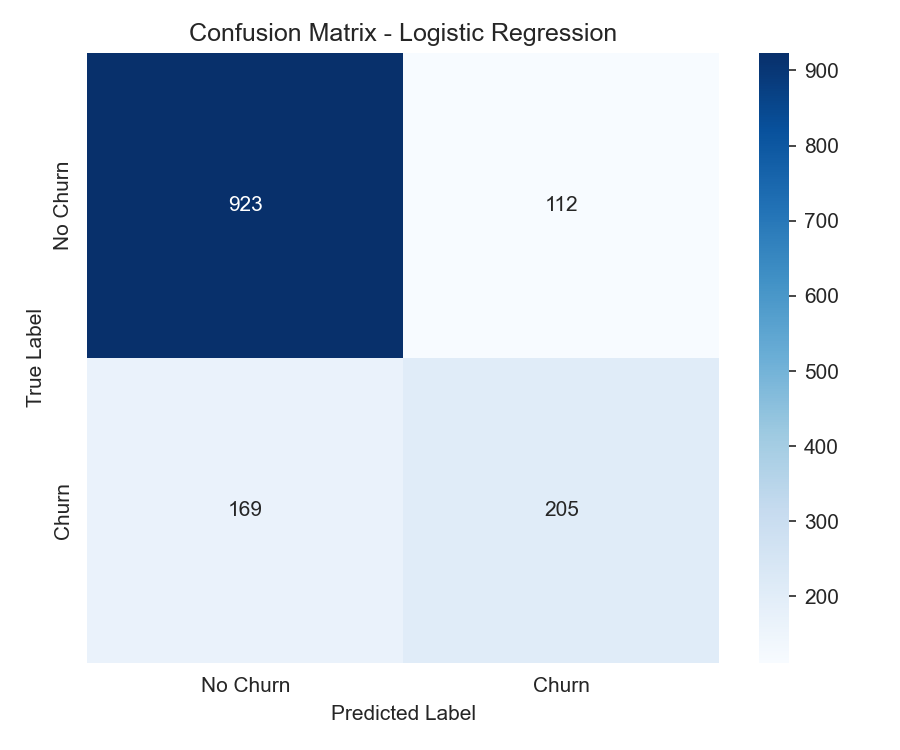

# Customer Churn Prediction using Logistic Regression

AI-ML Assignment 2

## Objective
Build a Logistic Regression model to predict whether a telecom customer is likely to churn (leave the company), based on their demographic information and service usage patterns.

## Dataset
**Telco Customer Churn Dataset** (Kaggle)
Link: https://www.kaggle.com/datasets/blastchar/telco-customer-churn

> The dataset is **not included in this repository**. Download `WA_Fn-UseC_-Telco-Customer-Churn.csv` from the Kaggle link above and place it in the project root before running the notebook.

## Libraries Used
- `pandas` – data loading and manipulation
- `numpy` – numerical operations
- `matplotlib`, `seaborn` – data visualization and confusion matrix plotting
- `scikit-learn` – preprocessing (`LabelEncoder`, `StandardScaler`), train/test split, `LogisticRegression`, and evaluation metrics

## Methodology
1. **Data Understanding** – Loaded the dataset, inspected its structure, and identified numerical features (`tenure`, `MonthlyCharges`, `TotalCharges`, `SeniorCitizen`), categorical features (contract type, internet service, payment method, etc.), and the target variable (`Churn`).
2. **Data Preprocessing**
   - Converted `TotalCharges` to numeric and imputed missing values with the median.
   - Dropped the non-predictive `customerID` column.
   - Label-encoded all categorical features and the target variable.
   - Split the data into 80% training / 20% testing (stratified on `Churn`).
   - Standardized numerical features with `StandardScaler`.
3. **Model Development** – Trained a `LogisticRegression` model on the processed training set and generated predictions on the held-out test set.
4. **Model Evaluation** – Computed Accuracy, Precision, Recall, and F1-Score, and visualized a Confusion Matrix. Inspected model coefficients to identify the features most associated with churn.
5. **Conclusion** – Summarized key findings, churn drivers, and a limitation of Logistic Regression for this problem.

## Results

| Metric    | Score  |
|-----------|--------|
| Accuracy  | 0.8006 |
| Precision | 0.6467 |
| Recall    | 0.5481 |
| F1-Score  | 0.5933 |



**Observations:**
1. The model correctly classifies about **80% of customers overall**, which is a solid baseline given the class imbalance in the dataset (~27% churn vs. ~73% no-churn).
2. **Recall (0.548) is noticeably lower than precision (0.647)** — the model misses more actual churners than it wrongly flags. In a business setting this matters: a missed churner is a lost customer the company never tried to retain, so the classification threshold could be lowered to catch more true churners at the cost of some extra false alarms.
3. The gap between accuracy and F1-score (0.593) highlights the effect of class imbalance — accuracy alone looks better than the model's actual balance of precision and recall on the minority (churn) class, which is why F1 and the confusion matrix are more informative here.

Coefficient inspection showed the largest churn drivers to be **contract type, tenure, and monthly charges** — customers on month-to-month contracts with short tenure and higher monthly bills are the most likely to churn.

## Conclusion
Logistic Regression proved to be an effective and interpretable baseline model for predicting customer churn, achieving 80% accuracy with a precision of 0.65 and recall of 0.55 on the test set. Contract type, tenure, monthly charges, and add-on services (online security, tech support) emerged as the strongest predictors — customers on month-to-month contracts with short tenure and higher bills are considerably more likely to churn, while long-term contracts and longer tenure correlate with retention. The moderate recall suggests the model is conservative about flagging churners, which could be adjusted via the classification threshold depending on business priorities. A key limitation of Logistic Regression is its assumption of a **linear relationship** between features and the log-odds of churn, which limits its ability to capture non-linear interactions between variables that models like Random Forest or XGBoost could better exploit.

## Repository Structure
```
├── Assignment-2.ipynb    # Full notebook: all 5 tasks
├── confusion_matrix.png  # Confusion matrix visualization
├── README.md             # This file
```

## How to Run
```bash
pip install pandas numpy matplotlib seaborn scikit-learn jupyter
# Download WA_Fn-UseC_-Telco-Customer-Churn.csv from Kaggle into this folder
jupyter notebook Assignment-2.ipynb
```